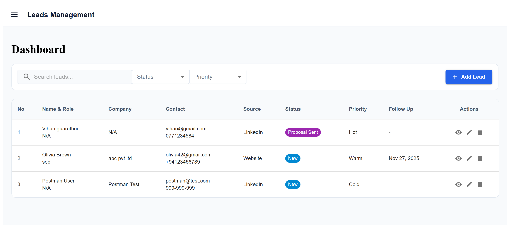
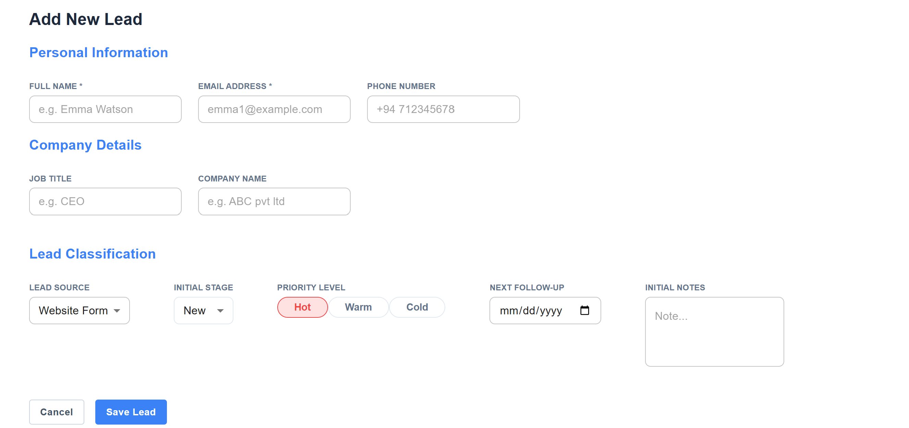
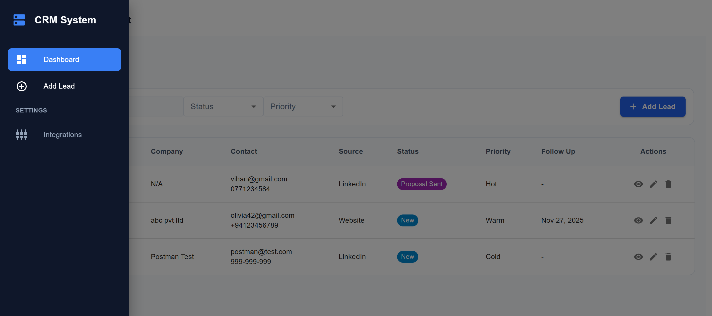

# Customer & Leads Management System


A full-stack application designed to streamline the management of potential customers (leads). This system tracks the sales process, centralizes customer data, and automates daily email reminders for scheduled follow-ups.

---

## 🌐 Live Demo
Check out the deployed application:

- **Frontend (Live App):** [Click Here to Open App](https://customer-leads-management-c3kz.vercel.app/)
- **Backend API:** [Server Status Link](https://customer-leads-management.onrender.com)
---

## 📖 Table of Contents
- [About the Project](#-about-the-project)
- [Key Features](#-key-features)
- [Tech Stack](#-tech-stack)
- [Screenshots](#-screenshots)
- [How to Run Locally](#-how-to-run-locally)
- [Environment Setup (.env)](#-environment-setup-env)
- [Testing the Auto-Capture](#-testing-the-auto-capture)
- [Automation Logic](#-automation-logic)

---

## 💡 About the Project
This project moves beyond simple data storage by integrating backend automation to help manage workflow.

**Core Functions:**
1.  **Lead Storage:** Supports manual entry via forms and automatic capture from external sources.
2.  **Pipeline Tracking:** Monitors lead status (e.g., "New", "Negotiating", "Converted") and priority levels.
3.  **Automated Reminders:** Checks schedules daily and sends email notifications for due follow-ups.
4.  **Project History:** Maintains a record of previous work completed for returning clients.

---

## 🚀 Key Features

### 🔹 Dashboard & Lead Management
- **Dashboard:** Features a responsive table with search functionality and filters for Status and Priority.
- **Lead Details:** A comprehensive profile view displaying communication logs, attached documents, and tasks.
- **Project History:** A dedicated section to record and view past client projects.

### 🔹 Backend Automation
- **Smart Scheduler:** Utilizes `node-cron` to execute a background task every morning at 9:00 AM.
- **Email Notifications:** Connects via SMTP (Nodemailer) to send real-time alerts when a follow-up is required.
- **Webhook Integration:** Includes a public API endpoint to receive lead data directly from external tools like Facebook Ads.

### 🔹 User Interface
- **Sidebar Navigation:** A collapsible sidebar optimized for both desktop and mobile views.
- **Modern Design:** Built with Material UI and Tailwind CSS for a clean, professional aesthetic.

---

## 🛠 Tech Stack

| Part | Technology Used |
| :--- | :--- |
| **Frontend** | React.js, Tailwind CSS, Material UI |
| **Backend** | Node.js, Express.js |
| **Database** | MongoDB (Atlas) |
| **Tools** | Axios, React Router, Nodemailer (Email) |

---

## 📸 Screenshots

| Dashboard |
| :---: |
| *Main view with data filtering and status indicators.* |
|  |

| Lead Details |
| :---: |
| *Profile view showing logs, documents, and history.* |
|  |

| Add New Lead |
| :---: |
| *New lead view.* |
|  |

| Slide Bar view |
| :---: |
| *Slide bar for better ui optimize.* |
|  |

<!-- | Integrations |
| :---: |
| *Sidebar settings displaying the Webhook URL.* |
|  | -->

---

## ⚙️ How to Run Locally

Follow these steps to set up the project.

### 1. Clone the Repository
```bash
git clone <your-repo-url>
cd <your-repo-name>
```

### 2. Backend Setup
Open a terminal in the `backend` folder:
```bash
cd backend
npm install
# Create a .env file 
npm start
```
*The server will start on port `5555`.*

### 3. Frontend Setup
Open a new terminal in the `frontend` folder:
```bash
cd frontend
npm install
npm run dev
```
*The app will launch at `http://localhost:5173`.*

---

## 🔐 Environment Setup (.env)

Connection to the database and email service requires a `.env` file.
Create a file named `.env` inside the `backend` folder with the following content:

```env
# Server Port
PORT=5555

# Database Connection
MONGO_DB_URL=mongodb+srv://<username>:<password>@cluster.mongodb.net/?appName=Cluster

# Email Settings (Required for Daily Reminders)
# Note: Use an "App Password" for Gmail.
EMAIL_USER=your-email@gmail.com
EMAIL_PASS=your-app-password
```

---

## 📡 Testing the Auto-Capture

The system exposes a Webhook endpoint to accept data from external sources. This can be tested using **Postman**.

**URL:** `POST https://customer-leads-management.onrender.com/leads/webhook/capture`  
**Body (JSON):**
```json
{
  "name": "Test Client",
  "email": "test@client.com",
  "source": "Facebook Ads",
  "phone": "+94 555-0199",
  "company": "Example pvt ltd",
  "notes": "Lead captured via Ad Campaign"
}
```
*Upon sending, the new lead will instantly appear on the Dashboard.*

---

## ⏰ Automation Logic
The system uses a server-side scheduler to handle follow-ups.

1.  **Trigger:** A background timer runs daily at **9:00 AM**.
2.  **Check:** The database is queried for leads with a `Next Follow Up` date matching **Today**.
3.  **Action:** 
    *   A system note is logged in the lead's history.
    *   An email summary is sent to the administrator.

